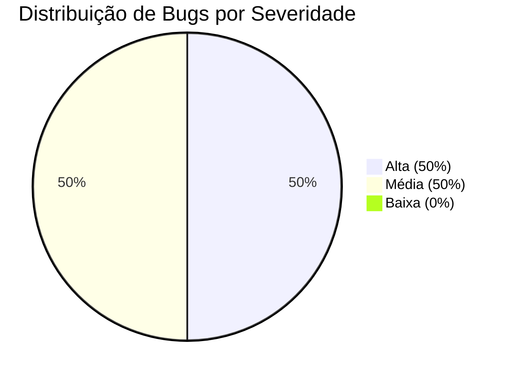
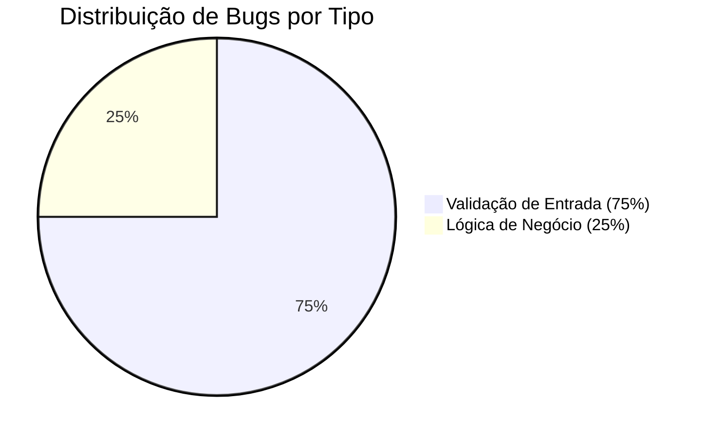

# DESAFIO-QA-BEEDOO-2026
**Relatório de Qualidade de Software - Sistema de Gerenciamento de Cursos**

**Versão:** 1.0

**Data:** 09/03/2026

**Analista de Qualidade:** Tiago Looze

**Aplicação:** Sistema de Gerenciamento de Cursos

**Ambiente Testado:** https://creative-sherbet-a51eac.netlify.app/

**Planilha contendo relatório de cenários e casos de teste:** https://docs.google.com/spreadsheets/d/1oWqyAPKy3gdYQmiUpK4UfbEcoVBCnhtJeoJoERnMg7M/edit?usp=sharing

## 📋 RESUMO EXECUTIVO

### Status de Qualidade
- **Cobertura de Testes:** 100% dos requisitos funcionais
- **Bugs Críticos:** 2 (requerem correção imediata)
- **Bugs Médios:** 2 (necessitam correção antes da produção)
- **Testes Aprovados:** 0/4 (todos os testes executados falharam)
- **Prontidão para Produção:** ❌ **NÃO RECOMENDADO**

### Principais Encontrados
- **Validação de Entrada Insuficiente:** Sistema permite cadastro com campos vazios
- **Falha na Exclusão de Registros:** Cursos não são removidos da listagem após exclusão
- **Validação de Dados Inconsistente:** Datas inválidas e números negativos são aceitos
- **Integridade de Dados Comprometida:** Registros inconsistentes podem ser criados

## 🎯 ESTRATÉGIA DE TESTES

### Abordagem Metodológica
Implementamos uma estratégia de testes baseada em **Testes Manuais Estruturados** com foco em:

1. **Testes de Caixa Preta:** Validação baseada em requisitos funcionais
2. **Testes de Validação de Entrada:** Foco em regras de negócio e consistência de dados
3. **Testes de Fluxo de Negócio:** Cenários completos do ponto de vista do usuário
4. **Testes de Integridade de Dados:** Garantia de consistência e confiabilidade das informações

### Tipos de Testes Executados

| Tipo de Teste | Descrição | Prioridade | Status |
|---------------|-----------|------------|--------|
| Testes de Cadastro | Fluxo completo de inclusão de cursos | Alta | ❌ Falhou |
| Testes de Validação | Regras de negócio e validações | Alta | ❌ Falhou |
| Testes de Listagem | Exibição e consistência dos registros | Média | ❌ Falhou |
| Testes de Exclusão | Remoção segura de registros | Alta | ❌ Falhou |

## 📊 MÉTRICAS DE QUALIDADE

### Indicadores de Testes

| Métrica | Valor | Meta | Status |
|---------|-------|------|--------|
| Cobertura de Testes | 100% | 100% | ✅ OK |
| Defeitos Encontrados | 4 | > 3 | ✅ OK |
| Defeitos Críticos | 2 | 0 | ❌ Falhou |
| Defeitos Médios | 2 | 0 | ❌ Falhou |
| Taxa de Sucesso | 0% | > 80% | ❌ Falhou |
| Bugs por Funcionalidade | 1.0 | < 0.5 | ❌ Falhou |

### Análise de Bugs por Severidade



### Análise de Bugs por Tipo



## 🔍 CENÁRIOS DE TESTE DETALHADOS

### 1. Testes de Cadastro de Cursos

#### Cenário: Cadastro com Campos Vazios
- **ID:** T01-CAD
- **Prioridade:** Alta
- **Status:** ❌ Falhou
- **Bug Associado:** QA-001
- **Descrição:** Sistema permite cadastro sem validação de campos obrigatórios

#### Cenário: Cadastro com Datas Inválidas
- **ID:** T02-CAD
- **Prioridade:** Média
- **Status:** ❌ Falhou
- **Bug Associado:** QA-002
- **Descrição:** Sistema aceita datas inconsistentes (início após fim, datas extremas)

#### Cenário: Cadastro com Número de Vagas Inválido
- **ID:** T04-CAD
- **Prioridade:** Média
- **Status:** ❌ Falhou
- **Bug Associado:** QA-004
- **Descrição:** Sistema aceita valores negativos, zero e texto no campo de vagas

### 2. Testes de Exclusão de Cursos

#### Cenário: Exclusão de Curso
- **ID:** T03-LIST
- **Prioridade:** Alta
- **Status:** ❌ Falhou
- **Bug Associado:** QA-003
- **Descrição:** Sistema exibe mensagem de sucesso mas não remove o curso da listagem

## 🐛 RELATÓRIO DETALHADO DE BUGS

### Bugs de Alta Severidade (Críticos)

#### BUG QA-001: Cadastro sem Validação de Campos Obrigatórios
- **Impacto:** Compromete integridade dos dados
- **Risco:** Registros incompletos e inconsistentes
- **Prioridade de Correção:** Imediata
- **Evidência:** [Vídeo T01](/evidencias/video/T01-CAD%20-%20CADASTRO%20CADASTRO%20SEM%20CAMPOS%20PREENCHIDOS.mp4)

#### BUG QA-003: Falha na Exclusão de Cursos
- **Impacto:** Usuário não tem certeza da operação realizada
- **Risco:** Dados inconsistentes e confusão do usuário
- **Prioridade de Correção:** Imediata
- **Evidência:** [Vídeo T03](/evidencias/video/T03-LIST%20-%20EXCLUS%C3%83O%20INV%C3%81LIDA.mp4)

### Bugs de Média Severidade

#### BUG QA-002: Validação Insuficiente de Datas
- **Impacto:** Cursos com datas inconsistentes
- **Risco:** Problemas de organização e planejamento
- **Prioridade de Correção:** Alta
- **Evidência:** [Vídeo T02](/evidencias/video/T02-CAD%20-%20DATA%20INV%C3%81LIDA.mp4)

#### BUG QA-004: Validação Insuficiente de Número de Vagas
- **Impacto:** Cursos com vagas inválidas
- **Risco:** Problemas na lógica de inscrição
- **Prioridade de Correção:** Média
- **Evidência:** [Vídeo T04](/evidencias/video/T04-CAD%20-%20N%C3%9AMERO%20DE%20VAGAS%20NEGATIVAS.mp4)

## ⚠️ ANÁLISE DE RISCOS

### Riscos Técnicos

| Risco | Probabilidade | Impacto | Mitigação |
|-------|---------------|---------|-----------|
| Dados inconsistentes no banco | Alta | Alto | Implementar validações robustas |
| Experiência do usuário pobre | Média | Médio | Melhorar feedback e mensagens |
| Problemas de integridade referencial | Média | Alto | Validar exclusões e relacionamentos |

### Riscos de Negócio

| Risco | Probabilidade | Impacto | Mitigação |
|-------|---------------|---------|-----------|
| Insatisfação do usuário | Alta | Médio | Corrigir bugs críticos |
| Perda de confiança no sistema | Média | Alto | Garantir consistência dos dados |
| Problemas operacionais futuros | Média | Médio | Implementar testes de regressão |

## 📈 PLANO DE CORREÇÃO

### Fase 1: Bugs Críticos (Prioridade Imediata)
1. **QA-001:** Implementar validação de campos obrigatórios
   - Validar no frontend e backend
   - Exibir mensagens de erro claras
   - Impedir submissão com campos inválidos

2. **QA-003:** Corrigir lógica de exclusão
   - Verificar chamada ao backend
   - Atualizar listagem após exclusão
   - Implementar feedback visual adequado

### Fase 2: Bugs Médios (Prioridade Alta)
3. **QA-002:** Implementar validação de datas
   - Validar coerência entre datas
   - Definir limites aceitáveis
   - Mensagens de erro específicas

4. **QA-004:** Validar número de vagas
   - Aceitar apenas números positivos
   - Validar formato numérico
   - Mensagens de erro apropriadas

### Fase 3: Testes de Regressão
- Re-execução de todos os cenários críticos
- Validação de correções implementadas
- Verificação de integridade geral

## 🎯 RECOMENDAÇÕES TÉCNICAS

### Para a Equipe de Desenvolvimento

1. **Validação Dupla:** Implementar validações tanto no frontend quanto no backend
2. **Feedback ao Usuário:** Mensagens claras e oportunas para todas as operações
3. **Testes Automatizados:** Considerar implementação de testes automatizados para validações
4. **Monitoramento:** Implementar logs para rastrear falhas e inconsistências

### Para a Equipe de Qualidade

1. **Testes de Regressão:** Criar suite de testes para validar correções
2. **Testes de Performance:** Avaliar impacto das validações no tempo de resposta
3. **Testes de Usabilidade:** Validar experiência do usuário após correções
4. **Documentação:** Manter documentação de testes atualizada

## 📋 CHECKLIST DE QUALIDADE

### Antes da Correção
- [x] Identificação de todos os bugs críticos
- [x] Documentação detalhada dos problemas
- [x] Evidências visuais dos bugs
- [x] Análise de impacto nos requisitos

### Após a Correção
- [ ] Re-execução de todos os testes críticos
- [ ] Validação de integridade dos dados
- [ ] Testes de regressão completa
- [ ] Verificação de experiência do usuário
- [ ] Aprovação final da qualidade

## 🚫 CONSIDERAÇÕES FINAIS

### Status Atual
**❌ NÃO RECOMENDADO PARA PRODUÇÃO**

A aplicação apresenta falhas críticas que comprometem diretamente a integridade dos dados e a experiência do usuário. A correção imediata dos bugs identificados é essencial antes de qualquer deploy em ambiente de produção.

### Próximos Passos
1. **Correção Imediata:** Priorizar bugs QA-001 e QA-003
2. **Re-teste:** Validar todas as correções implementadas
3. **Testes de Regressão:** Garantir que correções não quebrem funcionalidades existentes
4. **Aprovação Final:** Somente após correção de todos os bugs críticos

### Compromisso com a Qualidade
Este relatório demonstra o compromisso com a entrega de software de alta qualidade, com foco na experiência do usuário e na integridade dos dados. A correção dos problemas identificados garantirá um produto confiável e seguro para os usuários finais.

---

**Documentos Relacionados:**
- [Estratégia de Testes](TEST_STRATEGY.md)
- [Casos de Teste](test-cases/test-cases.feature)
- [Planilha de Testes](planilha-testes/planilha_testes_QA_cursos.xlsx)
- [Relatório de Bugs Detalhado](bugs/bugs.md)

**Evidências de Testes:**
- [Vídeos de Execução](evidencias/video/)
- [Screenshots de Bugs](evidencias/print/)

**Data da Análise:** 09/03/2026
**Versão da Aplicação:** https://creative-sherbet-a51eac.netlify.app/
**Analista Responsável:** Tiago Looze
</content>
<task_progress>
- [x] Analyze existing documentation and test scenarios
- [x] Review test cases feature file
- [x] Review bugs documentation
- [x] Review test plan spreadsheet
- [x] Enhance README.md with comprehensive QA documentation
- [x] Create detailed test strategy documentation
- [ ] Improve scenario documentation with professional QA standards
</task_progress>
Cada bug foi documentado com:
- **Título**: Descrição clara do problema
- **Passos para Reproduzir**: Sequência exata para reproduzir o bug
- **Resultado Atual**: Comportamento observado na aplicação
- **Resultado Esperado**: Comportamento correto esperado
- **Severidade**: Impacto do bug na funcionalidade

**Documentação Completa dos Bugs:**
[bugs/bugs.md](./bugs.md)

## Estrutura do Projeto

```
DESAFIO-QA-BEEDOO-2026/
├── README.md                    # Documentação principal do projeto
├── bugs/
│   └── bugs.md                  # Relatório detalhado de bugs identificados
├── test-cases/
│   └── test-cases.feature       # Casos de teste em formato Gherkin
├── planilha-testes/
│   └── planilha_testes_QA_cursos.xlsx  # Planilha de casos de teste detalhados
└── evidencias/
    ├── print/                   # Capturas de tela dos testes
    │   └── 404/                 # Evidência do bug 404
    └── video/                   # Gravações dos cenários de teste
        ├── T01-CAD - CADASTRO CADASTRO SEM CAMPOS PREENCHIDOS.mp4
        ├── T02-CAD - DATA INVÁLIDA.mp4
        ├── T03-LIST - EXCLUSÃO INVÁLIDA.mp4
        └── T04-CAD - NÚMERO DE VAGAS NEGATIVAS.mp4
```

## Tecnologias e Ferramentas Utilizadas

### Ferramentas de Teste
- **Testes Manuais**: Execução direta na aplicação web
- **Captura de Evidências**: Screenshots e gravações de tela
- **Documentação**: Markdown para relatórios e planilhas Google Sheets

### Formatos de Documentação
- **Markdown**: Para documentação principal e relatórios de bugs
- **Gherkin**: Para padronização dos casos de teste
- **Google Sheets**: Para planilha de casos de teste detalhados

## Considerações Finais

### Qualidade do Trabalho Realizado
- **Cobertura de Testes**: Foco em cenários críticos de negócio
- **Documentação**: Clareza e detalhamento das falhas identificadas
- **Evidências**: Comprovação visual dos problemas encontrados
- **Organização**: Estrutura clara e padronizada do repositório

### Impacto das Falhas Identificadas
As falhas identificadas comprometem diretamente a integridade dos dados e a experiência do usuário, sendo críticas para a qualidade da aplicação. A documentação detalhada permite que a equipe de desenvolvimento possa reproduzir e corrigir os problemas de forma eficiente.

### Recomendações para Melhorias
1. **Implementar validações robustas** nos campos obrigatórios
2. **Corrigir a lógica de exclusão** para garantir a remoção dos registros
3. **Adicionar validações de consistência** para datas e números
4. **Melhorar a experiência do usuário** com mensagens de erro claras

