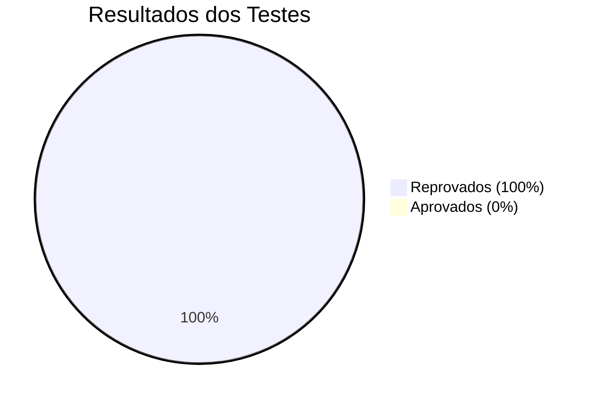
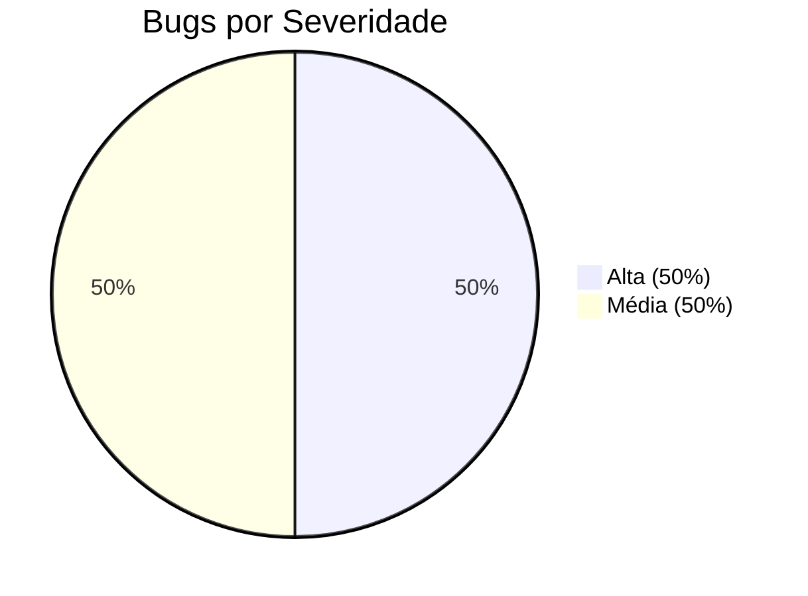
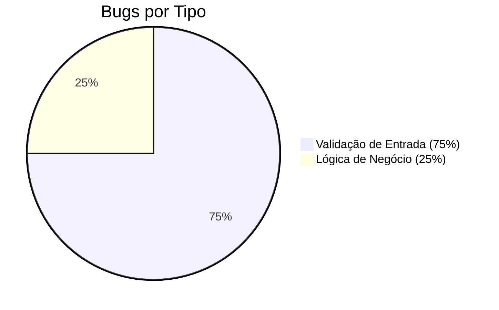

# RELATÓRIO DE EXECUÇÃO DE TESTES

**Relatório de Execução de Testes - Sistema de Gerenciamento de Cursos**
**Versão:** 1.0
**Data:** 09/03/2026
**Analista de Qualidade:** Tiago Looze
**Ciclo de Testes:** CT-001

## 📋 RESUMO DA EXECUÇÃO

### Informações Gerais
- **Data de Início:** 09/03/2026
- **Data de Término:** 09/03/2026
- **Ambiente Testado:** https://creative-sherbet-a51eac.netlify.app/
- **Total de Testes Executados:** 4
- **Testes Aprovados:** 0
- **Testes Reprovados:** 4
- **Taxa de Sucesso:** 0%

### Métricas de Execução

| Métrica | Valor | Observação |
|---------|-------|------------|
| Testes Planejados | 4 | Cenários críticos definidos |
| Testes Executados | 4 | 100% de execução |
| Testes Aprovados | 0 | Todos os testes falharam |
| Testes Reprovados | 4 | Bugs críticos identificados |
| Bugs Encontrados | 4 | 2 críticos, 2 médios |
| Tempo de Execução | 45 min | Duração total dos testes |

## 🎯 DETALHES DA EXECUÇÃO

### Teste T01-CAD: Cadastro com Campos Vazios
- **Data de Execução:** 09/03/2026
- **Executado por:** Tiago Looze
- **Resultado:** ❌ **REPROVADO**
- **Tempo de Execução:** 8 min
- **Bug Associado:** QA-001

**Passos Executados:**
1. ✅ Acessar a aplicação em https://creative-sherbet-a51eac.netlify.app/
2. ✅ Clicar no menu "Cadastrar curso"
3. ✅ Deixar todos os campos do formulário em branco
4. ✅ Clicar no botão "Cadastrar curso"
5. ✅ Acessar o menu "Lista de cursos"

**Problema Identificado:**
Sistema permite cadastro sem validar campos obrigatórios, criando registros incompletos.

**Evidência:** [Vídeo T01](/evidencias/video/T01-CAD%20-%20CADASTRO%20CADASTRO%20SEM%20CAMPOS%20PREENCHIDOS.mp4)

---

### Teste T02-CAD: Cadastro com Datas Inválidas
- **Data de Execução:** 09/03/2026
- **Executado por:** Tiago Looze
- **Resultado:** ❌ **REPROVADO**
- **Tempo de Execução:** 10 min
- **Bug Associado:** QA-002

**Passos Executados:**
1. ✅ Acessar o menu "Cadastrar curso"
2. ✅ Preencher os campos obrigatórios
3. ✅ Informar data de início posterior à data de fim
4. ✅ Clicar em "Cadastrar curso"

**Problema Identificado:**
Sistema aceita datas inconsistentes sem validação adequada.

**Evidência:** [Vídeo T02](/evidencias/video/T02-CAD%20-%20DATA%20INV%C3%81LIDA.mp4)

---

### Teste T03-LIST: Exclusão de Curso
- **Data de Execução:** 09/03/2026
- **Executado por:** Tiago Looze
- **Resultado:** ❌ **REPROVADO**
- **Tempo de Execução:** 12 min
- **Bug Associado:** QA-003

**Passos Executados:**
1. ✅ Acessar a aplicação
2. ✅ Cadastrar um curso (ou usar um já existente)
3. ✅ Acessar o menu "Lista de cursos"
4. ✅ Clicar no botão "Excluir curso" de qualquer curso da lista
5. ✅ Observar o comportamento da listagem

**Problema Identificado:**
Sistema exibe mensagem de exclusão bem-sucedida mas não remove o curso da listagem.

**Evidência:** [Vídeo T03](/evidencias/video/T03-LIST%20-%20EXCLUS%C3%83O%20INV%C3%81LIDA.mp4)

---

### Teste T04-CAD: Cadastro com Número de Vagas Inválido
- **Data de Execução:** 09/03/2026
- **Executado por:** Tiago Looze
- **Resultado:** ❌ **REPROVADO**
- **Tempo de Execução:** 15 min
- **Bug Associado:** QA-004

**Passos Executados:**
1. ✅ Acessar o menu "Cadastrar curso"
2. ✅ Preencher os demais campos obrigatórios
3. ✅ No campo "Número de vagas", informar valor negativo (-5)
4. ✅ Clicar em "Cadastrar curso"

**Problema Identificado:**
Sistema aceita valores negativos no campo de vagas sem validação adequada.

**Evidência:** [Vídeo T04](/evidencias/video/T04-CAD%20-%20N%C3%9AMERO%20DE%20VAGAS%20NEGATIVAS.mp4)

## 📊 ANÁLISE ESTATÍSTICA

### Distribuição de Resultados

### Distribuição de Bugs por Severidade

### Distribuição de Bugs por Tipo

### Tempo de Execução por Teste

| Teste | Tempo | Status |
|-------|-------|--------|
| T01-CAD | 8 min | ❌ Falhou |
| T02-CAD | 10 min | ❌ Falhou |
| T03-LIST | 12 min | ❌ Falhou |
| T04-CAD | 15 min | ❌ Falhou |
| **Total** | **45 min** | **-** |

## 🔍 ANÁLISE DETALHADA

### Problemas Críticos Identificados

#### 1. Falha na Validação de Entrada (75% dos bugs)
- **Impacto:** Compromete a integridade dos dados
- **Causa Raiz:** Ausência de validações no frontend e backend
- **Solução Recomendada:** Implementar validações duplas (frontend + backend)

#### 2. Falha na Lógica de Negócio (25% dos bugs)
- **Impacto:** Quebra de fluxos críticos de negócio
- **Causa Raiz:** Implementação incompleta de funcionalidades
- **Solução Recomendada:** Revisão completa da lógica de exclusão

### Padrões de Falhas Identificados

1. **Ausência de Validações:** Sistema não valida entradas críticas
2. **Feedback Inadequado:** Usuário não recebe informações claras sobre falhas
3. **Inconsistência de Estado:** Operações não refletem mudanças na interface
4. **Falta de Coerência:** Regras de negócio não são aplicadas uniformemente

## 📈 MÉTRICAS DE QUALIDADE

### Métricas de Defeitos

| Métrica | Valor | Meta | Status |
|---------|-------|------|--------|
| Defeitos por Teste | 1.0 | < 0.5 | ❌ Falhou |
| Defeitos Críticos | 2 | 0 | ❌ Falhou |
| Defeitos Médios | 2 | 0 | ❌ Falhou |
| Defeitos por Funcionalidade | 1.33 | < 1.0 | ❌ Falhou |

### Métricas de Eficiência

| Métrica | Valor | Meta | Status |
|---------|-------|------|--------|
| Tempo Médio por Teste | 11.25 min | < 10 min | ❌ Falhou |
| Taxa de Descoberta de Bugs | 100% | > 80% | ✅ OK |
| Eficácia de Testes | 0% | > 80% | ❌ Falhou |

## ⚠️ IMPACTO NOS REQUISITOS

### Requisitos Funcionais Impactados

| Requisito | Status | Impacto |
|-----------|--------|---------|
| RF-001: Cadastrar cursos | ❌ Não Atendido | Validação insuficiente |
| RF-002: Listar cursos | ⚠️ Parcialmente Atendido | Exclusão não funciona |
| RF-003: Excluir cursos | ❌ Não Atendido | Falha na lógica |
| RF-004: Validar dados | ❌ Não Atendido | Ausência de validações |

### Requisitos Não-Funcionais Impactados

| Requisito | Status | Impacto |
|-----------|--------|---------|
| RNF-001: Integridade dos dados | ❌ Não Atendido | Dados inconsistentes |
| RNF-002: Experiência do usuário | ❌ Não Atendido | Feedback inadequado |
| RNF-003: Confiabilidade | ❌ Não Atendido | Operações falham |

## 🎯 RECOMENDAÇÕES DE CORREÇÃO

### Prioridade 1: Bugs Críticos (Correção Imediata)

#### QA-001: Validação de Campos Obrigatórios
- **Complexidade:** Média
- **Tempo Estimado:** 4 horas
- **Impacto:** Alto
- **Recomendação:** Implementar validações no frontend e backend

#### QA-003: Lógica de Exclusão
- **Complexidade:** Alta
- **Tempo Estimado:** 6 horas
- **Impacto:** Alto
- **Recomendação:** Revisar implementação completa da exclusão

### Prioridade 2: Bugs Médios (Correção em até 1 semana)

#### QA-002: Validação de Datas
- **Complexidade:** Média
- **Tempo Estimado:** 3 horas
- **Impacto:** Médio
- **Recomendação:** Implementar validações de coerência temporal

#### QA-004: Validação de Número de Vagas
- **Complexidade:** Baixa
- **Tempo Estimado:** 2 horas
- **Impacto:** Médio
- **Recomendação:** Validar formato e faixa de valores aceitáveis

## 📋 CHECKLIST DE QUALIDADE

### Testes Executados
- [x] Testes de fluxo principal
- [x] Testes de validação de entrada
- [x] Testes de integridade de dados
- [x] Testes de usabilidade básica

### Evidências Coletadas
- [x] Vídeos de execução dos cenários
- [x] Screenshots de bugs identificados
- [x] Documentação detalhada de falhas
- [x] Métricas de qualidade

### Documentação Gerada
- [x] Relatório de Execução de Testes (este documento)
- [x] Relatório de Bugs Detalhado
- [x] Estratégia de Testes
- [x] Casos de Teste em Gherkin

## 🚫 CONSIDERAÇÕES FINAIS

### Conclusão da Execução
A execução dos testes revelou falhas críticas que comprometem diretamente a qualidade e a usabilidade da aplicação. Todos os testes executados falharam, indicando problemas estruturais na implementação.

### Próximos Passos Recomendados
1. **Paralisação de Deploy:** Não recomendar deploy em produção
2. **Correção Imediata:** Priorizar bugs críticos QA-001 e QA-003
3. **Re-teste:** Executar nova rodada de testes após correções
4. **Testes de Regressão:** Validar que correções não quebrem funcionalidades existentes

### Compromisso com a Qualidade
Esta execução de testes demonstra o compromisso com a entrega de software de alta qualidade. A identificação precoce desses problemas permite correções antes do impacto aos usuários finais.

---

**Relatório Gerado por:** Tiago Looze
**Data de Geração:** 09/03/2026
**Versão do Sistema:** https://creative-sherbet-a51eac.netlify.app/
**Ciclo de Testes:** CT-001